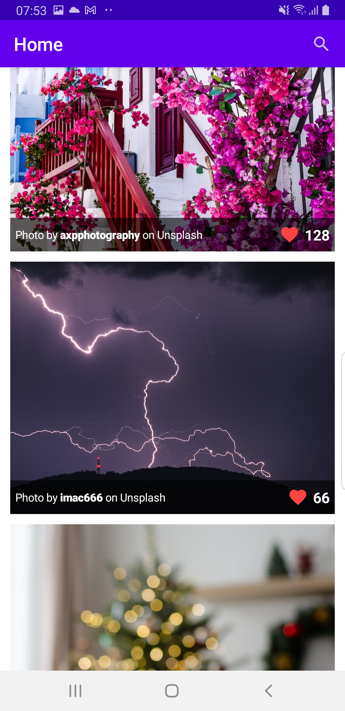
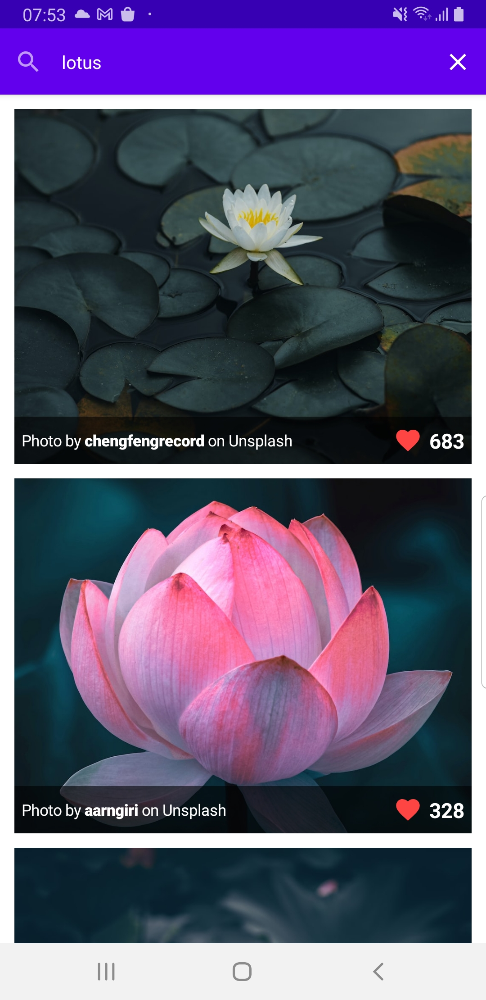

# Athena-Paintings
App to search images from unsplash api

## The Brief

App that communicates with Unsplash API in order to display it's images in the app

Pagination will be from Network and a local Database. 
Instead of getting all data at once, it fetches the data page by page. 

The is a separated branch where the app is devided by layer.

## Architecture & Libraries
    - MVVM
    - Local & Remote Data Sources
    - Retrofit
    - ROOM Database
    - Dependency Injection - Dagger-Hilt
    - Kotlin Coroutines
    - Flow
    - Paging 3

## App preview:

Image #1            |  Image #2             
:-------------------------:|:----------------------------:
    |      

